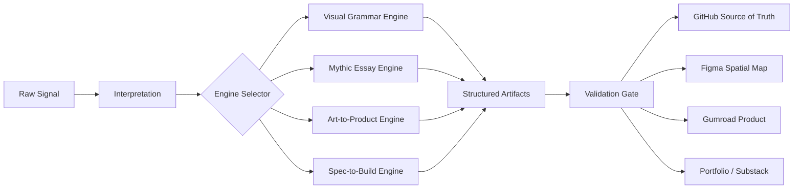

# Figma / FigJam Board Spec

## Purpose

Figma should not be treated as the source of truth for this workflow. GitHub is the source of truth. Figma is the spatial, visual, and collaborative surface.

Use Figma/FigJam for:

- pipeline maps
- engine diagrams
- project boards
- visual grammar taxonomies
- design tokens
- component maps
- artifact inventories
- critique boards
- handoff diagrams

Use GitHub for:

- canonical docs
- schemas
- templates
- version history
- validation checks
- issues and PRs
- build workflows
- agent instructions

## Recommended FigJam board

Title: **Seed Loom: Signal-to-System Map**

Frames:

1. **Signal Intake** — raw inputs, files, notes, references, images, links
2. **Engine Selector** — Visual Grammar, Mythic Essay, Art-to-Product, Spec-to-Build
3. **Artifact Factory** — essays, specs, metadata, prompts, UI kits, product pages
4. **Validation Gate** — failure modes, QA, source preservation, shippability
5. **Publishing/Commerce Layer** — GitHub, Gumroad, portfolio, Substack, Figma, social
6. **Project Cards** — NacreOS, Tierra Viva, Paper Muse, Web Builds, Essay Series

## Mermaid diagram

## Figma vs GitHub decision rule

| Need | Use GitHub | Use Figma |
|---|---:|---:|
| Versioned source of truth | Yes | No |
| Visual mapping | Optional | Yes |
| Editable design components | No | Yes |
| Agent handoff | Yes | Optional |
| QA and validation | Yes | Optional |
| Spatial workshop board | No | Yes |
| Product docs | Yes | Optional |
| Public portfolio visuals | Optional | Yes |

## Out-of-the-box use

Create a FigJam diagram from the Mermaid map and link it from the README. Then create Figma design files per project only after the project has passed intake and engine selection.

This prevents Figma from becoming a beautiful dumping ground. It becomes a visual interface over a versioned system.
